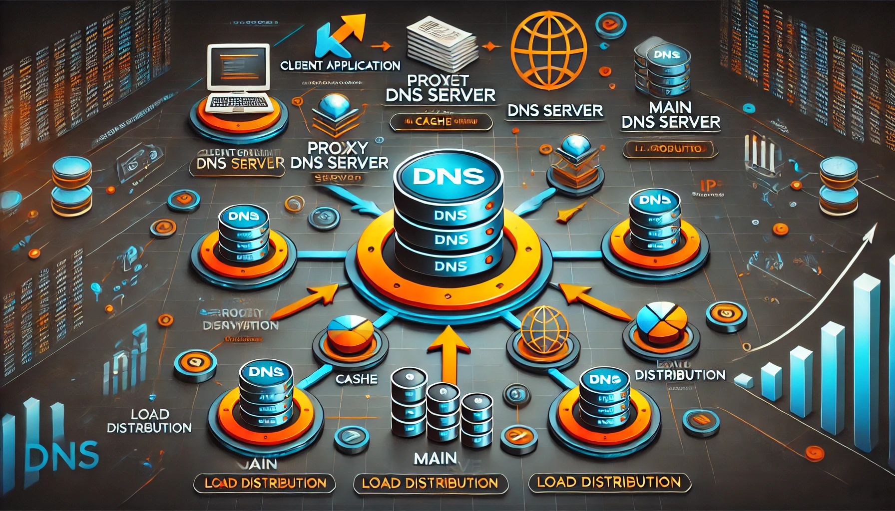
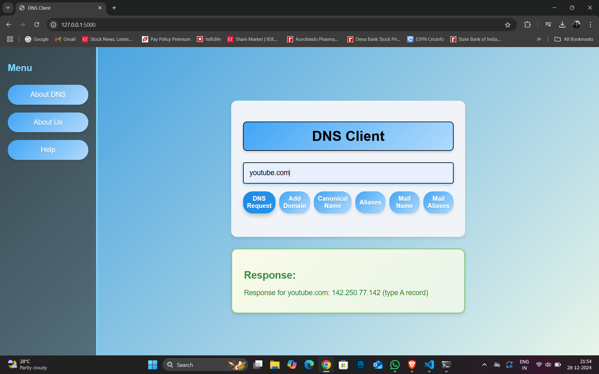
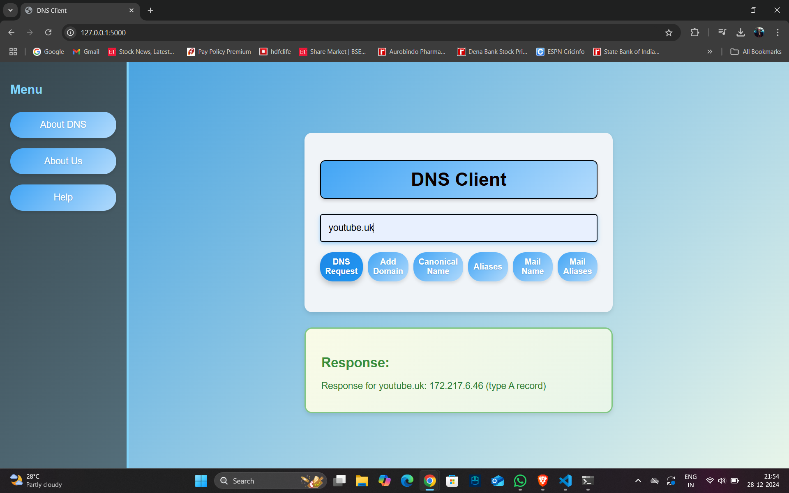
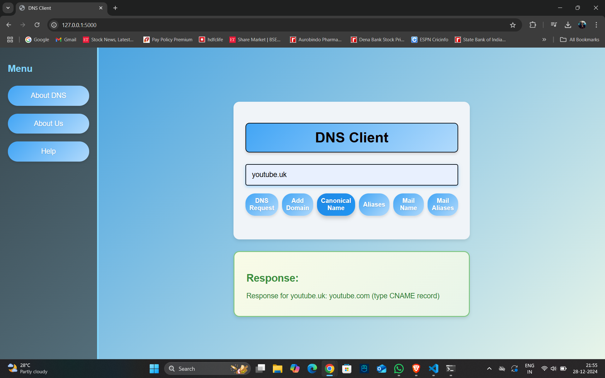
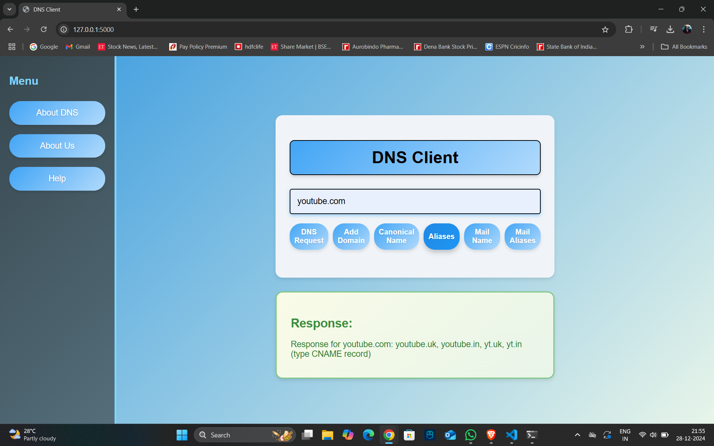
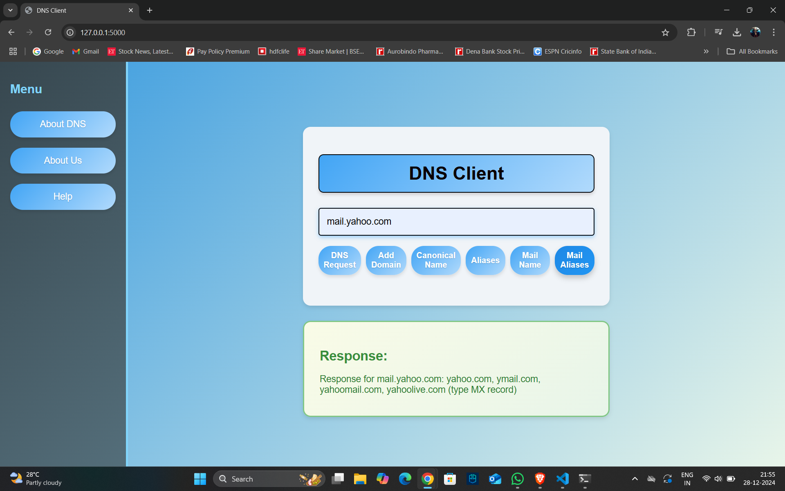
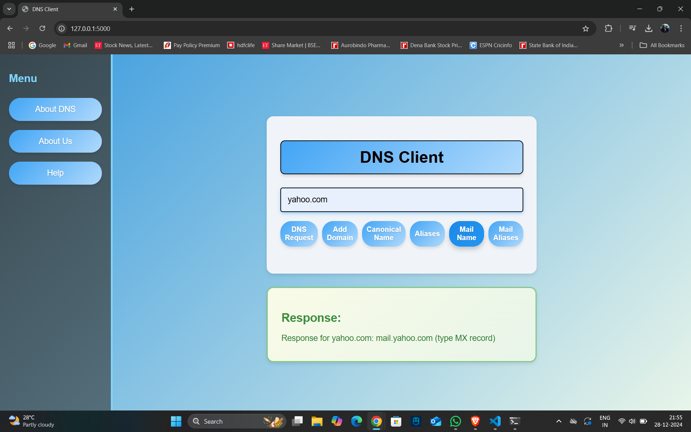
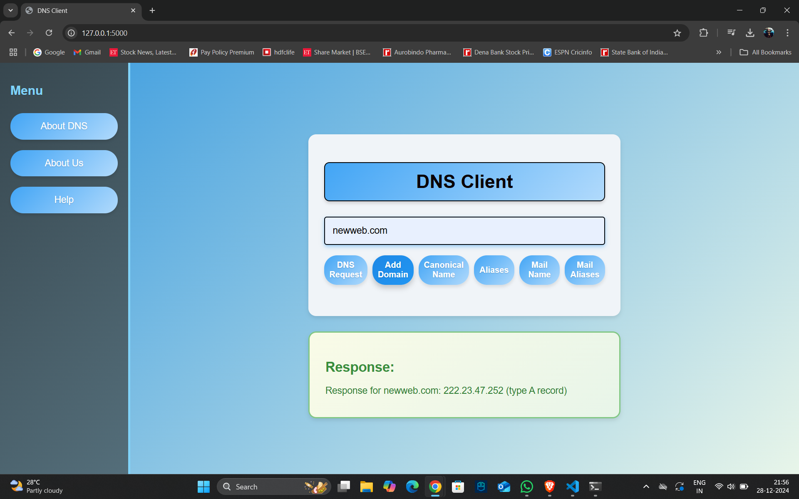
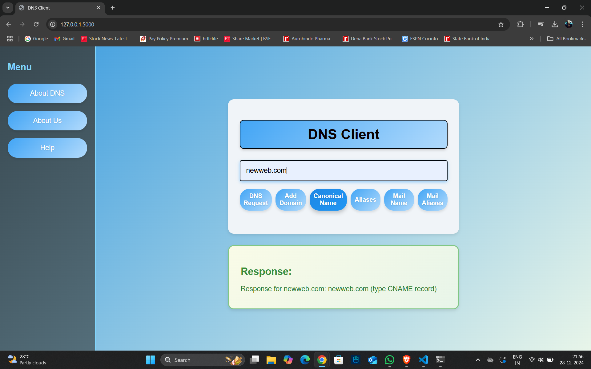

# 🌐 **Centralized DNS with Proxy DNS Server**


---

## **📖 Overview**

This project demonstrates how **DNS (Domain Name System)** operates behind the scenes by integrating a **Centralized DNS** with a **Proxy DNS Server**. Built using **socket programming**, it simplifies DNS resolution while incorporating features like:

- Load distribution.
- Hostname aliasing.
- Mail aliasing.
- IP address resolution
 
This project is ideal for students, developers, and enthusiasts interested in networking fundamentals.

---

## **🔗 System Architecture**

The project is divided into the following components:

1. **Client Application**
   - A web-based interface built with Flask for user interactions.

2. **Proxy DNS Server**
   - Handles local DNS requests and forwards unresolved queries to the main DNS server.

3. **Centralized DNS Server**
   - Maintains a centralized database for DNS resolution, including load distribution and aliasing.

4. **Database Management**
   - SQLite databases store records for domains, canonical names, mail aliases, and cached data.



---

## **🎡 Features**

### **1. Load Distribution**
- Ensures fair distribution of traffic across multiple IPs for the same domain using round-robin rotation.

### **2. Hostname Aliasing**
- Maps multiple aliases to canonical names (e.g., `yt.in ⇒ youtube.com`).

### **3. Mail Aliasing**
- Supports mail server lookups using MX (Mail Exchange) records.

### **4. Dynamic Domain Addition**
- Clients can register new domains with auto-generated IPs.

### **5. Proxy Optimization**
- Local caching in the proxy server for faster lookups and reduced main DNS load.

---

## **📚 Code Structure**

```
|-- client.py            # Flask-based web client
|-- Proxy_DNS.py         # Proxy DNS server script
|-- main_DNS.py          # Main DNS server script
|-- add_records.py       # Script to initialize SQLite databases
|-- databases            # containing SQLite database files
|-- templates/index.html # contaning the html file  
```

---

## **🚀 How to Run**

### **Step 1:** Set Up Databases

Run the script to create and populate the SQLite databases:

```bash
python add_records.py
```

### **Step 2:** Start Servers

1. Start the Main DNS Server:
   ```bash
   python main_DNS.py
   ```

2. Start the Proxy DNS Server:
   ```bash
   python Proxy_DNS.py
   ```

### **Step 3:** Start the Client Application

Launch the Flask web app:

```bash
python client.py
```

Access the web interface at `http://127.0.0.1:5000`.

---

## **📷 Screenshots**
To show the Demo of the project 

### **Client Web Interface**


















### **DNS Resolution Output**
main_DNS output:


Proxy_DNS output:

---

## **🔄 Future Enhancements**

- Add support for **IPv6 records**.
- Implement advanced caching techniques for the proxy server.
- Introduce HTTPS for secure communications.

---

## **🤝 Contributions**

We welcome contributions! Feel free to fork this repository, make enhancements, and submit pull requests.

---

## **📬 Contact**

For queries or feedback, reach out via:

- **Email:** [velamalapavankrishna@gmail.com](mailto:velamalapavankrishna@gmail.com)
- **Instagram:** [@pavankrishna_v](https://www.instagram.com/pavankrishna_v/)

---

**Made with ❤️ by [V. Pavan Krishna]**

